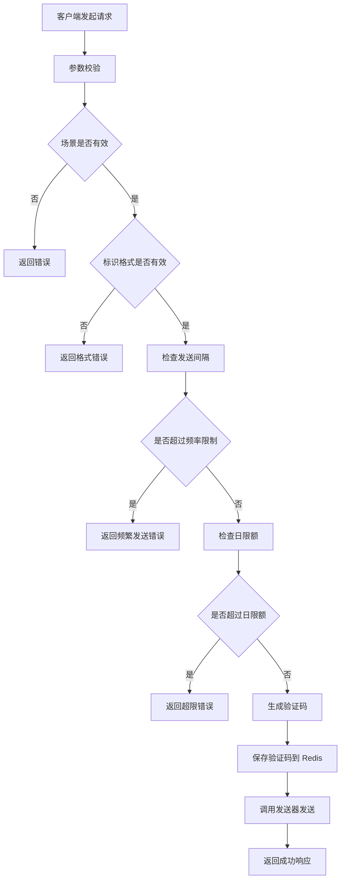
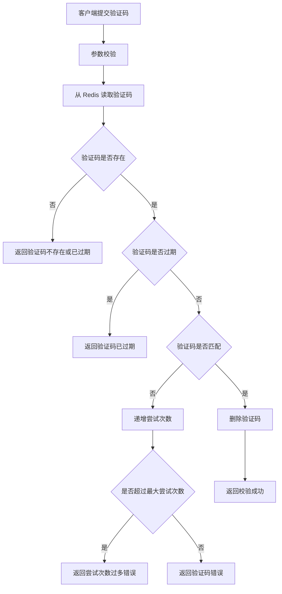

# 发送验证码功能需求文档

## 1. 文档概述

### 1.1 目的
本文档描述"智光"项目（zhiguang-backend）中发送验证码功能的需求说明，涵盖功能概述、业务流程、技术实现、接口定义等内容，用于指导开发、测试和维护。

### 1.2 范围
本功能模块提供基于手机号或邮箱的验证码发送与校验服务，支持注册、登录、重置密码等多种业务场景。

### 1.3 目标读者
- 后端开发人员
- 前端开发人员
- 测试人员
- 产品经理

---

## 2. 功能概述

### 2.1 功能描述
发送验证码功能用于在用户注册、登录、重置密码等场景下，向用户的手机号或邮箱发送一次性验证码，以确保操作的安全性和用户身份的真实性。

### 2.2 核心特性
- **多场景支持**：注册（REGISTER）、登录（LOGIN）、重置密码（RESET_PASSWORD）
- **多标识类型**：支持手机号（PHONE）和邮箱（EMAIL）两种标识类型
- **安全性保障**：
  - 发送频率限制（默认 60 秒内只能发送一次）
  - 每日发送次数上限（默认每个标识每天最多 10 次）
  - 验证码有效期控制（默认 5 分钟）
  - 最大尝试次数限制（默认最多尝试 5 次）
- **可扩展性**：验证码发送器采用接口设计，支持替换为真实的短信/邮件服务

---

## 3. 业务流程

### 3.1 发送验证码流程



### 3.2 校验验证码流程



---

## 4. 功能需求详细说明

### 4.1 发送验证码接口

#### 4.1.1 接口定义
- **路径**：`POST /api/v1/auth/send-code`
- **鉴权**：公开（无需认证）
- **Content-Type**：`application/json`

#### 4.1.2 请求参数

| 参数名 | 类型 | 必填 | 说明 | 示例值 |
|--------|------|------|------|--------|
| scene | VerificationScene | 是 | 验证码使用场景 | REGISTER/LOGIN/RESET_PASSWORD |
| identifierType | IdentifierType | 是 | 标识类型 | PHONE/EMAIL |
| identifier | String | 是 | 标识值（手机号或邮箱） | 13800138000 / example@email.com |

#### 4.1.3 响应参数

| 参数名 | 类型 | 说明 |
|--------|------|------|
| identifier | String | 标准化后的标识（手机号去空格，邮箱转小写） |
| scene | VerificationScene | 验证码场景 |
| expireSeconds | int | 验证码有效期（秒），默认 300 秒 |

#### 4.1.4 请求示例

```json
{
  "scene": "REGISTER",
  "identifierType": "PHONE",
  "identifier": "13800138000"
}
```

#### 4.1.5 响应示例

**成功响应（HTTP 200）**
```json
{
  "identifier": "13800138000",
  "scene": "REGISTER",
  "expireSeconds": 300
}
```

**错误响应（HTTP 400）**
```json
{
  "errorCode": "BAD_REQUEST",
  "message": "手机号格式错误"
}
```

**错误响应（HTTP 429）**
```json
{
  "errorCode": "VERIFICATION_RATE_LIMIT",
  "message": "验证码发送过于频繁"
}
```

```json
{
  "errorCode": "VERIFICATION_DAILY_LIMIT",
  "message": "验证码发送次数超限"
}
```

### 4.2 验证码校验

#### 4.2.1 校验规则
- 验证码必须在规定时间内使用（默认 5 分钟）
- 验证码最多尝试次数（默认 5 次）
- 验证成功后立即失效
- 失败时递增尝试次数，超过限制后可能触发惩罚性过期

#### 4.2.2 校验状态

| 状态码 | 说明 |
|--------|------|
| SUCCESS | 校验成功 |
| NOT_FOUND | 验证码不存在 |
| EXPIRED | 验证码已过期 |
| MISMATCH | 验证码不匹配 |
| TOO_MANY_ATTEMPTS | 尝试次数过多 |

---

## 5. 配置项说明

### 5.1 验证码相关配置

配置文件位置：`AuthProperties.Verification`

| 配置项 | 类型 | 默认值 | 说明 |
|--------|------|--------|------|
| codeLength | int | 6 | 验证码位数（纯数字） |
| ttl | Duration | 5 分钟 | 验证码有效期 |
| maxAttempts | int | 5 | 最大校验尝试次数 |
| sendInterval | Duration | 60 秒 | 同一标识连续发送的最小间隔 |
| dailyLimit | int | 10 | 同一标识每日发送上限 |

### 5.2 配置示例（application.yml）

```yaml
auth:
  verification:
    code-length: 6
    ttl: 5m
    max-attempts: 5
    send-interval: 60s
    daily-limit: 10
```

---

## 6. 技术实现

### 6.1 核心组件

#### 6.1.1 VerificationService
- **职责**：验证码业务逻辑核心服务
- **主要方法**：
  - `sendCode(VerificationScene, String)`：发送验证码
  - `verify(VerificationScene, String, String)`：校验验证码
- **限流逻辑**：
  - 发送间隔控制（基于 Redis 的 SETNX）
  - 每日限额控制（基于 Redis 的 INCR + TTL）

#### 6.1.2 CodeSender（接口）
- **职责**：抽象验证码发送行为
- **当前实现**：`LoggingCodeSender`（仅记录日志）
- **扩展方向**：可替换为短信服务商 SDK 或邮件服务

#### 6.1.3 VerificationCodeStore（接口）
- **职责**：验证码存储与校验
- **当前实现**：`RedisVerificationCodeStore`
- **数据结构**：Redis Hash
  - Key 格式：`auth:code:{scene}:{identifier}`
  - 字段：`code`（验证码）、`maxAttempts`（最大尝试次数）、`attempts`（已尝试次数）

#### 6.1.4 IdentifierValidator
- **职责**：标识格式校验
- **校验规则**：
  - 手机号：中国大陆 11 位，以 1 开头（正则：`^1\\d{10}$`）
  - 邮箱：标准邮箱格式（大小写不敏感）

### 6.2 Redis 键设计

| 用途 | Key 格式 | 数据类型 | TTL |
|------|---------|----------|-----|
| 验证码存储 | `auth:code:{scene}:{identifier}` | Hash | 配置的 ttl |
| 发送间隔控制 | `auth:code:last:{scene}:{identifier}` | String | sendInterval |
| 日计数统计 | `auth:code:count:{scene}:{identifier}:{yyyyMMdd}` | String | 1 天 |

---

## 7. 异常处理

### 7.1 错误码定义

| 错误码 | HTTP 状态码 | 说明 |
|--------|------------|------|
| BAD_REQUEST | 400 | 请求参数错误（场景/标识类型/标识值为空或格式错误） |
| VERIFICATION_RATE_LIMIT | 429 | 发送频率过高（未达到最小间隔） |
| VERIFICATION_DAILY_LIMIT | 429 | 超过每日发送上限 |
| VERIFICATION_NOT_FOUND | 404 | 验证码不存在或已过期 |
| VERIFICATION_MISMATCH | 400 | 验证码错误 |
| VERIFICATION_TOO_MANY_ATTEMPTS | 429 | 验证码尝试次数过多 |

### 7.2 全局异常处理
所有业务异常通过 `GlobalExceptionHandler` 统一处理，返回标准化错误响应格式。

---

## 8. 安全考虑

### 8.1 防刷机制
- **发送频率限制**：同一标识 60 秒内只能发送一次
- **日发送限额**：同一标识每天最多发送 10 次
- **验证码尝试限制**：单个验证码最多尝试 5 次

### 8.2 数据安全
- 验证码存储于 Redis，设置自动过期时间
- 验证成功后立即删除，防止重用
- 验证码为随机生成的 6 位纯数字，使用 `SecureRandom` 保证随机性

### 8.3 标识标准化
- 手机号：去除首尾空格
- 邮箱：转换为小写并去除首尾空格

---

## 9. 扩展性设计

### 9.1 验证码发送器扩展
当前实现 `LoggingCodeSender` 仅记录日志，生产环境可通过实现 `CodeSender` 接口接入真实服务：

```java
@Component
public class SmsCodeSender implements CodeSender {
    @Override
    public void sendCode(VerificationScene scene, String identifier, String code, int expireMinutes) {
        // 调用短信服务商 API
    }
}
```

### 9.2 验证码类型扩展
当前仅支持 6 位纯数字验证码，可通过修改 `generateNumericCode()` 方法支持字母 + 数字组合。

### 9.3 更多场景支持
通过扩展 `VerificationScene` 枚举可支持更多业务场景，如：
- 绑定手机/邮箱
- 解绑操作
- 身份验证

---

## 10. 测试建议

### 10.1 单元测试
- 验证码生成逻辑测试
- 标识格式校验测试
- 发送频率限制测试
- 日限额控制测试
- 验证码校验逻辑测试

### 10.2 集成测试
- 完整的发送验证码流程测试
- Redis 存储与校验测试
- 不同场景下的端到端测试

### 10.3 压力测试
- 高频发送场景下的限流效果验证
- Redis 并发读写性能测试

---

## 11. 部署与监控

### 11.1 依赖服务
- **Redis**：用于验证码存储与限流计数
- **日志系统**：记录验证码发送信息（开发环境）

### 11.2 监控指标
建议监控以下指标：
- 验证码发送成功率
- 验证码校验成功率
- 触发限流的请求比例
- Redis 键数量与内存占用

### 11.3 日志记录
开发环境下，验证码内容会记录到日志中：
```
Send verification code scene=REGISTER identifier=13800138000 code=123456 expireMinutes=5
```

---

## 12. 版本历史

| 版本 | 日期 | 作者 | 变更说明 |
|------|------|------|----------|
| v1.0 | 2026-03-16 | - | 初始版本，基于现有代码实现整理 |

---

## 附录

### A. 相关类图

```
┌─────────────────────────┐
│   AuthController        │
│  - sendCode()           │
│  - register()           │
└───────────┬─────────────┘
            │
            ▼
┌─────────────────────────┐
│   AuthService           │
│  - sendCode()           │
│  - validateIdentifier() │
│  - normalizeIdentifier()│
└───────────┬─────────────┘
            │
            ▼
┌─────────────────────────┐
│ VerificationService     │
│  - sendCode()           │
│  - verify()             │
│  - enforceSendInterval()│
│  - enforceDailyLimit()  │
└─────┬───────────┬───────┘
      │           │
      ▼           ▼
┌───────────┐ ┌──────────────┐
│ CodeSender│ │VerificationCodeStore│
│ -sendCode()│ │ -saveCode()       │
└───────────┘ │ -verify()         │
              │ -invalidate()     │
              └───────────────────┘
```

### B. 枚举定义

**VerificationScene（验证码场景）**
- REGISTER：注册
- LOGIN：登录
- RESET_PASSWORD：重置密码

**IdentifierType（标识类型）**
- PHONE：手机号
- EMAIL：邮箱

**VerificationCodeStatus（验证码状态）**
- SUCCESS：成功
- NOT_FOUND：未找到
- EXPIRED：过期
- MISMATCH：不匹配
- TOO_MANY_ATTEMPTS：尝试次数过多
